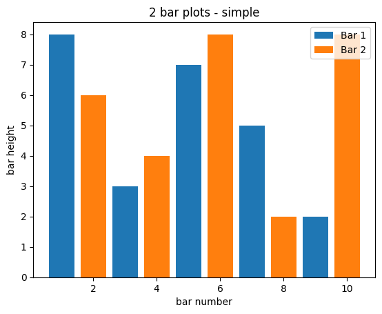
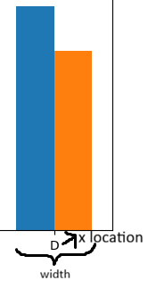
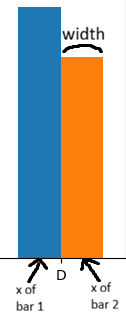

# 📊 Python Matplotlib 

---

## Table of Contents


<!-- @import "[TOC]" {cmd="toc" depthFrom=1 depthTo=6 orderedList=false} -->

<!-- code_chunk_output -->

- [📊 Python Matplotlib](#-python-matplotlib)
  - [Table of Contents](#table-of-contents)
  - [1. Basic Plotting Workflow](#1-basic-plotting-workflow)
  - [2. Common Charts](#2-common-charts)
  - [3. Line Plot](#3-line-plot)
    - [Function `plt.plot()`](#function-pltplot)
    - [Use format string (faster)](#use-format-string-faster)
    - [Plot multiple sets of data](#plot-multiple-sets-of-data)
    - [Display as figure and Save as image](#display-as-figure-and-save-as-image)
    - [Draw a line with defined angle](#draw-a-line-with-defined-angle)
  - [4. Bar Chart (`plt.bar()`)](#4-bar-chart-pltbar)
    - [Horizontal bar char (`plt.barh()`)](#horizontal-bar-char-pltbarh)
    - [Stacked Bar Chart](#stacked-bar-chart)
    - [2 bar plots](#2-bar-plots)
      - [Simple method](#simple-method)
      - [More beautiful method](#more-beautiful-method)
  - [5. Histogram (`plt.hist`)](#5-histogram-plthist)
  - [6. Scatter Plot (`plt.scatter()`)](#6-scatter-plot-pltscatter)
  - [7. Pie Plot (`plt.pie()`)](#7-pie-plot-pltpie)
  - [8. Figure Size (`plt.figure()`)](#8-figure-size-pltfigure)
  - [9. Grid (`plt.grid()`)](#9-grid-pltgrid)
  - [10. Saving Plots (`plt.savefig()`)](#10-saving-plots-pltsavefig)
  - [11. Subplots (`plt.subplot()`) – Advanced](#11-subplots-pltsubplot--advanced)
  - [12. Common Exam Mistakes](#12-common-exam-mistakes)

<!-- /code_chunk_output -->


---

## 1. Basic Plotting Workflow 

Almost every plot follows this code structure:

```python
import matplotlib.pyplot as plt

# Defines data x
# Defines corresponding function y = f(x)

plt.plot(x, y)        # Create plot
plt.title("Title")    # Add title
plt.xlabel("X label")
plt.ylabel("Y label")
plt.show()            # Display plot
```

**Key idea:**
Matplotlib works by **building a figure step-by-step**, then displaying it.

Function `plt.plot()` creates a graph between 2 argument variables.

---

## 2. Common Charts
- Line chart
- Bar chart (vertical & horizontal)
- Scatter plot
- Histogram
- Pie chart
- 3D plot
- Subplot (multiple plots in one figure)

---

## 3. Line Plot

Plot the y axis versus x axis as lines and/or markers.

### Function `plt.plot()`

**Purpose:**

Used to visualize:

* GDP growth over time
* Inflation trends
* Stock prices
* Economic indicators by year/quarter

**Function:**
The command syntax:
```python
plt.plot([x], y, [fmt], data=None, **kwargs)
```
- `fmt`: **format string** of how the line is drawn. (explained later in section [Use Format String](#use-format-string-faster))
- `data`: the **label** or **source** of the data.
- `**kwargs`: **additional keywords arguments** for line styling.

Some line-styling arguents:
```python
marker = 'o' # Define the marker character of the plot
label = 'label' # The label of the plot line
color = blue # The color of the plot line
linestyle = '-' # '-' (solid line), '--' (dashed line), ':' (dot line)
linewidth = 1.5 # Define the line width
```


**Example:**

```python
import matplotlib.pyplot as plt
import numpy as np

# Define x and y = f(x) = x^2
x = np.array([2, 5, 6])
y = x ** 2

# Prepare the line, with marker '0', and line label
plt.plot(x, y, marker='o', color=blue, label="Pow 2 curve")
plt.title("Plot of y = x^2")
plt.xlabel("x")
plt.ylabel("y")
plt.legend() # Display the line label note
plt.show()
```

**Output:**


### Use format string (faster)

Instead of specifying `marker = 'o'` and `linestyle = '--'`, we can simply use format string `"bo--"`, stands for blue marker `o` and dashed line.

Format of format string is `color` + `marker` + `line type`.
```python
plt.plot(x, y, "bo--")
```


### Plot multiple sets of data

To plot multiple sets of data, the most straightforward way is to call `plot()` multiple times.
```python
plt.plot(x1, y1)
plt.plot(x2, y2)
```

**Example:** let's add another set of data where `y = x^3`.
```python
# y = x^2
x1 = np.array([2, 5, 6])
y1 = x1 ** 2
# y = x^3
x2 = np.array([2, 5, 6])
y2 = x2 ** 3

# Blue marker 'o' dashed line
plt.plot(x1, y1, "bo--", label="Pow 2 curve")
plt.plot(x2, y2, "rx-", label="Pow 3 Curve")
```


The second way is to specify multiple sets of x and y.
```python
plt.plot(x1, y1, marker='o', x2, y2,marker='x')
```

**Example:**

```python
# Chia đoạn từ 0 đến 5 thành các bước 0.2
t = np.arange(0., 5., 0.2) 

# Vẽ 3 đường
# 1. Red dashed line: y = x
# 2. Blue color, square marker, no line: y = x^2
# 3. Green color, triangle marker, no line: y = x^3
plt.plot(t, t, 'r--',   # red dashed line 
         t, t**2, 'bs', # blue color, sqr marker, no line
         t, t**3, 'g^') # Triangle down is v, up is ^
```


### Display as figure and Save as image
Use `plt.figure(figsize=(height, width))` to create a figure with corresponding size.
To save the image, use `plt.savefig(file_location)`.

```python
plt.figure(figsize=(7, 6))
... # Define the plot
plt.savefig("figure.png") # Remember to put before show()
plt.show()
```
> Remember to put `savefig()` before `show()`.

Below is the saved image.


### Draw a line with defined angle

For example, with angle = 45 degree, the code is.
```python
# Draw a 45-degree line
# => tan(45) = y / x
# => y = x * tan(45) 
# Use math.tan(45)
import math

# Define x and y
x = np.array([0, 1, 2, 3, 4, 5, 6])
y = x * math.tan(math.pi / 4) # tan(pi / 4) = tan(45)

plt.plot(x, y, label = "45-degree line")
plt.title('45-degree Line')
plt.xlabel('x')
plt.ylabel('y')
plt.legend()
plt.show()
```


---

## 4. Bar Chart (`plt.bar()`)

**Used for comparing categories**
For comparing numeric values of several groups

**Purpose:**

Common in economics for:

* Comparing GDP by country
* Comparing production by sector
* Comparing firm revenues

**Function:**

```python
plt.bar(x, height, color=None)
```

**Parameters:**

| Parameter | Meaning                         |
| --------- | ------------------------------- |
| `x`       | Categories (strings or numbers) |
| `height`  | Values                          |
| `color`   | Bar color                       |

**Example:**

```python
categories = ["Agriculture", "Industry", "Services"]
values = [15, 35, 50]

plt.bar(categories, values)
plt.title("GDP Contribution by Sector")
plt.ylabel("Percentage (%)")
plt.show()
```

**Output:**


Instead of using 2 arrays, we can use **dictionary**. For example.
```python
dict = {
  'Ngôn ngữ': 60,
  'Kế toán': 310,
  'QTKD': 360,
  'CNTT': 580,
  'Điện tử': 340,
  'Sinh học': 290
}
# dict.keys() --> 'Ngôn ngữ', 'Kế toán', ...
# dict.values() --> 60, 310, ...

plt.bar(dict.keys(), dict.values())
plt.title("Các ngành tuyển sinh ĐHQT")
plt.xlabel("Ngành")
plt.ylabel("Chỉ tiêu")
plt.show()
```


### Horizontal bar char (`plt.barh()`)

Use `plt.barh()` to plot horizontal bar chart.
```python
plt.barh(dict.keys(), dict.values()) # Horizontal bar
```


### Stacked Bar Chart

Use `bottom` argument in `plt.bar()`. For example.
```python
categories = ['A', 'B', 'C', 'D']

# Should define it as numpy array, convenient for 
# array/matrix operations
part1 = np.array([20, 35, 30, 25])
part2 = np.array([25, 32, 34, 20])
part3 = np.array([10, 10, 10, 10])

x = np.arange(len(categories)) # x = [0,1,2,3]
 
plt.bar(x, part1, label='Type 1')
# Define the bottom as part1, so that
# bottom_part2 = part1 + (part2 values).
plt.bar(x, part2, bottom = part1, label='Type 2')
plt.bar(x, part3, bottom = part1 + part2, label='Type 3')

plt.xticks(x, categories) # assign labels to x axis
plt.ylabel('Value')
plt.title('Stacked Bar Plot')
plt.legend()
plt.show()
```


### 2 bar plots

#### Simple method

Use 2 dictionaries (4 arrays) to plot it. Fill each dictionary with its own data.
```python
x1 = np.array([1, 3, 5, 7, 9]) 
y1 = np.array([8, 3, 7, 5, 2])

x2 = np.array([2, 4, 6, 8, 10])
y2 = np.array([6, 4, 8, 2, 8])

# Fill bar plot 1
plt.bar(x1, y1, label="Bar 1")
# Fill bar plot 2
plt.bar(x2, y2, label="Bar 2")
plt.legend()
plt.xlabel('bar number')
plt.ylabel('bar height')
plt.title('2 bar plots - simple')
plt.show()

# If want x axis to appear from 1 to 10, add this command
# full_x = np.concatenate([x1, x2])
# plt.xticks(full_x)
```


#### More beautiful method

The above method does not display 2 categories sticking together. If we want no space between 2 categories bar chart, define their locations. Explaination is after the code.
```python
categories = ['A', 'B', 'C', 'D']
data1 = [20, 35, 30, 25]
data2 = [25, 32, 34, 20]

x = np.arange(len(categories))
width = 0.35

# Set the position for bar plot 1
plt.bar(x - width/2, data1, width, label='Type 1')
# Set the position for bar plot 2
plt.bar(x + width/2, data2, width, label='Type 2')

plt.xticks(x, categories)
plt.ylabel('Value')
plt.title('Grouped Bar Plot')
plt.legend()
plt.show()
```


The explaination can be visualized through this image.
<div style="text-align: center">
  
</div>

---

## 5. Histogram (`plt.hist`)

Displays a distribution of numerical data by grouping it into "bins" or intervals, then showing the frequency of data points within each bin as a bar.

**Purpose:**

Used to visualize:

* Income distribution
* Returns distribution
* Price variation
* Residuals in regression

**Function:**

```python
plt.hist(data, bins=10, density=False)
```

**Parameters:**

| Parameter | Meaning                  |
| --------- | ------------------------ |
| `data`    | Numerical data (array or sequence of (n,) arrays)           |
| `bins`    | Number of bars.<br>If *bins* is integer, it defines # of equal-width bins in the range.<br>If *bins* is sequence, it defines bin edges. Example below.           |
| `density` | Normalize to probability |

**Example:**

```python
import numpy as np

data = np.random.randint(0, 10, size = 10)
# data = [5, 6, 7, 9, 0, 5, 4, 5, 4, 0]

plt.hist(data, bins=4)
plt.title("Histogram of Income Distribution")
plt.xlabel("Income")
plt.ylabel("Frequency")
plt.show()
```

**Output:**


---

## 6. Scatter Plot (`plt.scatter()`)

Used to study relationships between variables.

**Purpose:**
Very common in economics:

* Income vs consumption
* Education vs wage
* Price vs demand

**Function:**

```python
plt.scatter(x, y, color=None, s=None)
```

**Parameters:**

| Parameter | Meaning     |
| --------- | ----------- |
| `x`, `y`  | Data points |
| `color`   | Point color |
| `s`       | Point size  |

**Example:**

```python
x = np.linspace(-1, 1, 25)
y = np.random.randn(25)

plt.scatter(x, y)
plt.title('Random variables')
plt.xlabel('x')
plt.ylabel('y')
```

**Output:**


---

## 7. Pie Plot (`plt.pie()`)


---

## 8. Figure Size (`plt.figure()`)

```python
plt.figure(figsize=(8, 5))
```

| Value                     | Meaning        |
| ------------------------- | -------------- |
| `figsize=(width, height)` | Size in inches |

Used to make plots clearer in reports.

---

## 9. Grid (`plt.grid()`)

```python
plt.grid(True)
```

Adds grid lines – **very useful for reading values**.

---

## 10. Saving Plots (`plt.savefig()`)

```python
plt.savefig("output.png", dpi=300)
```

Common in reports and assignments.

---

## 11. Subplots (`plt.subplot()`) – Advanced

**Purpose:**

Show multiple plots in one figure.

```python
plt.subplot(1, 2, 1)  # rows, columns, index
plt.plot(x, y)

plt.subplot(1, 2, 2)
plt.hist(data)

plt.show()
```

---

## 12. Common Exam Mistakes

❌ Forgetting `plt.show()`
❌ Mixing x and y lengths
❌ Forgetting labels and titles
❌ Using bar chart instead of histogram

---
